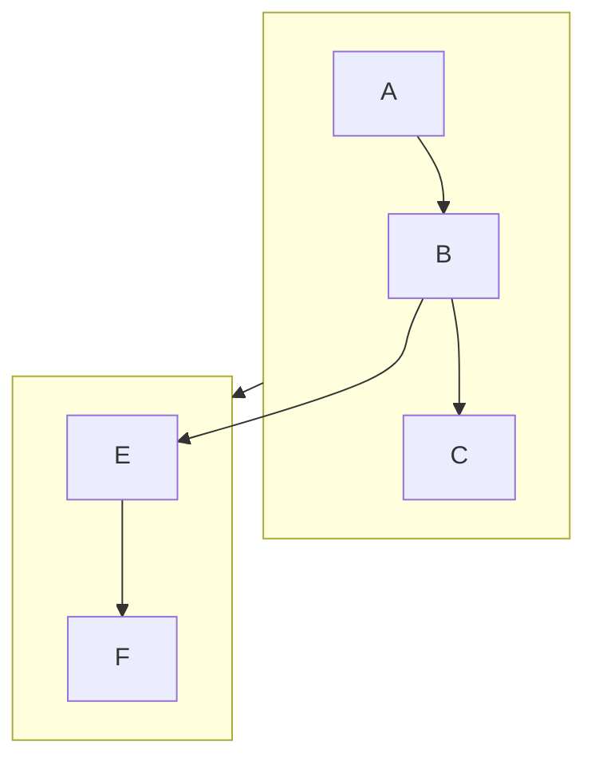

# Guide PrimeTime
## _Dinh-Toi Nguyen_

## Concept: Perform STA using PrimeTime
> What is STA?
- Static Timing Analysis is a method of validating the timing performace of a design by checking all possible paths for timing violations. PrimeTime checks fof these violations *(vi phạm)*
> What is PrimeTime?
- Accurate Delay Calculator
- Performs Hierarchical STA
- Can include Signal Integrity Analysis (PT-SI)
- Can include Power Analysis (PT-PX)
- Capacity and Performance
> What is PrimeTime SI?
- PrimeTime SI is a license which enables PrimeTime's crosstalk features - it is not a tool
- PrimeTime SI crosstalk analysis charter (điều lệ)
    - To enable the analysis of Signal Integrity effects on delay and noise
    - Much faster and more exhaustive analysis than traditional SPICE tools
        - SPICE can only perform one sweep per analysis 
        - "Infinite" speed-up over SPICE analysis
    - A complete solution
> What is PrimeTime PX?
- Prime PX is a license which enables PrimeTime's power analysis feature
- PrimeTime PX power analysis charter 
    - Analyze Average power and Peak power
    - Perform per-layout clock tree power estimation and report power savings due to clock gating
    - Perform Multi voltage power analysis
    - View/debug/qualify switching activity annotattions and power consumption using the GUI
    - Perform early (fast) and sigoff (accurate) power analysis
> PrimeTime Input and Output




## Environment

# Markdown Flowchart Example


## 1. Does your design 

Dillinger uses a number of open source projects to work properly:

- [AngularJS] - HTML enhanced for web apps!
- [Ace Editor] - awesome web-based text editor
- [markdown-it] - Markdown parser done right. Fast and easy to extend.
- [Twitter Bootstrap] - great UI boilerplate for modern web apps
- [node.js] - evented I/O for the backend
- [Express] - fast node.js network app framework [@tjholowaychuk]
- [Gulp] - the streaming build system
- [Breakdance](https://breakdance.github.io/breakdance/) - HTML
to Markdown converter
- [jQuery] - duh

And of course Dillinger itself is open source with a [public repository][dill]
 on GitHub.

## Installation

Dillinger requires [Node.js](https://nodejs.org/) v10+ to run.

Install the dependencies and devDependencies and start the server.

```sh
cd dillinger
npm i
node app
```

For production environments...

```sh
npm install --production
NODE_ENV=production node app
```

## Plugins

Dillinger is currently extended with the following plugins.
Instructions on how to use them in your own application are linked below.

| Plugin | README |
| ------ | ------ |
| Dropbox | [plugins/dropbox/README.md][PlDb] |
| GitHub | [plugins/github/README.md][PlGh] |
| Google Drive | [plugins/googledrive/README.md][PlGd] |
| OneDrive | [plugins/onedrive/README.md][PlOd] |
| Medium | [plugins/medium/README.md][PlMe] |
| Google Analytics | [plugins/googleanalytics/README.md][PlGa] |

## Development

Want to contribute? Great!

Dillinger uses Gulp + Webpack for fast developing.
Make a change in your file and instantaneously see your updates!

Open your favorite Terminal and run these commands.

First Tab:

```sh
node app
```

Second Tab:

```sh
gulp watch
```

(optional) Third:

```sh
karma test
```

#### Building for source

For production release:

```sh
gulp build --prod
```

Generating pre-built zip archives for distribution:

```sh
gulp build dist --prod
```

## Docker

Dillinger is very easy to install and deploy in a Docker container.

By default, the Docker will expose port 8080, so change this within the
Dockerfile if necessary. When ready, simply use the Dockerfile to
build the image.

```sh
cd dillinger
docker build -t <youruser>/dillinger:${package.json.version} .
```

This will create the dillinger image and pull in the necessary dependencies.
Be sure to swap out `${package.json.version}` with the actual
version of Dillinger.

Once done, run the Docker image and map the port to whatever you wish on
your host. In this example, we simply map port 8000 of the host to
port 8080 of the Docker (or whatever port was exposed in the Dockerfile):

```sh
docker run -d -p 8000:8080 --restart=always --cap-add=SYS_ADMIN --name=dillinger <youruser>/dillinger:${package.json.version}
```

> Note: `--capt-add=SYS-ADMIN` is required for PDF rendering.

Verify the deployment by navigating to your server address in
your preferred browser.

```sh
127.0.0.1:8000
```

## License

MIT

**Free Software, Hell Yeah!**

[//]: # (These are reference links used in the body of this note and get stripped out when the markdown processor does its job. There is no need to format nicely because it shouldn't be seen. Thanks SO - http://stackoverflow.com/questions/4823468/store-comments-in-markdown-syntax)

   [dill]: <https://github.com/joemccann/dillinger>
   [git-repo-url]: <https://github.com/joemccann/dillinger.git>
   [john gruber]: <http://daringfireball.net>
   [df1]: <http://daringfireball.net/projects/markdown/>
   [markdown-it]: <https://github.com/markdown-it/markdown-it>
   [Ace Editor]: <http://ace.ajax.org>
   [node.js]: <http://nodejs.org>
   [Twitter Bootstrap]: <http://twitter.github.com/bootstrap/>
   [jQuery]: <http://jquery.com>
   [@tjholowaychuk]: <http://twitter.com/tjholowaychuk>
   [express]: <http://expressjs.com>
   [AngularJS]: <http://angularjs.org>
   [Gulp]: <http://gulpjs.com>

   [PlDb]: <https://github.com/joemccann/dillinger/tree/master/plugins/dropbox/README.md>
   [PlGh]: <https://github.com/joemccann/dillinger/tree/master/plugins/github/README.md>
   [PlGd]: <https://github.com/joemccann/dillinger/tree/master/plugins/googledrive/README.md>
   [PlOd]: <https://github.com/joemccann/dillinger/tree/master/plugins/onedrive/README.md>
   [PlMe]: <https://github.com/joemccann/dillinger/tree/master/plugins/medium/README.md>
   [PlGa]: <https://github.com/RahulHP/dillinger/blob/master/plugins/googleanalytics/README.md>
